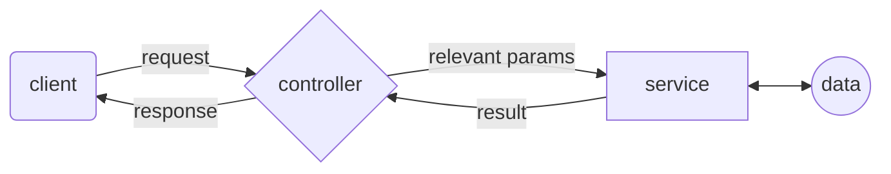

## API Server

The server is built on Node.js and Express.js. It's responsible for handling the client's requests, and communicating with the database and the TCP server.

The server exposes it's functionality through a REST API. Here's a list of the API's endpoints:

| Endpoint | Method | Description |
|----------|--------|-------------|
| /api/token | POST | Returns a JWT token for the user |
| /api/users | POST | Registers a new user |
| /api/users/:email | GET | Returns the user's information |
| /api/users/:email | PATCH | updates the user's information |
| /api/users/:email | DELETE | Deletes the user |
| /api/users/:email/friends | GET | Returns the user friends |
| /api/users/:email/friends | POST | Send a new friend request to the user |
| /api/users/:email/friends/:fid | GET | Accept a friend request |
| /api/users/:email/friends/:fid | DELETE | Deletes a user from the friends list |
| /api/users/:email/friendRec/:fid | DELETE | Decline friend request |
| /api/users/:email/posts | GET | Returns the user's posts|
| /api/users/:email/posts | POST | Creates new post|
| /api/users/:email/posts/:fid | DELETE | Deletes a post|
| /api/users/:email/posts/:fid | POST | Creates a new comment|
| /api/users/:email/posts/:fid | PATCH | Updates a post|
| /api/users/:email/comments/:cid | GET | Returns the comment's information|
| /api/users/:email/posts/:pid/:cid | DELETE | Deletes a comment|
| /api/users/:email/posts/:pid/:cid | PATCH | Updates a comment|
| /api/posts | GET | Returns 25 posts|

**Note:** besides the first two endpoints, all the other endpoints require the user to be authenticated. The authentication is done by sending the JWT token in the request's header.

## Server Architecture
The server is designed using the MVCS architecture (except for the view, since there is no user interface). Here's a simple diagram of the server's architecture:

### Notes

- According to the assignment instructions, when a user logs in and reaches the main page, the application displays up to 25 posts. Five of these posts are from users who are not friends with the logged-in user, while the remaining posts are from friends of the user. This ensures a diverse and dynamic feed for a better user experience.

- The android client supports english, textual messages only (only ascii charachters)

- The posts date times show up with times from the GMT+2 time zone
